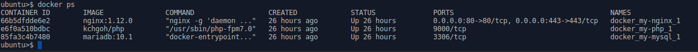

WordPress Docker
============

Scripts for quickly setting up a WordPress installation from scratch, with all
dependencies provided as Docker containers, namely:
- NGINX web server
- PHP7 (and the required extensions)
- MariaDB/MySQL database
- Let's Encrypt certbot (SSL certificate)



Prerequisites
-----------
(Versions/environments other than noted below may also work, but YMMV.)
- Ubuntu Linux 16.04
- Docker version 17.06.1-ce
- Docker Compose version 1.15.0 
- To make life easy, the relevant users and groups on the host system should 
match with what the Docker containers expect:
	- users: www-data (uid=33), mysql (uid=999), docker (any other uid)
	- groups: www-data (gid=33), mysql (gid=999), docker (any other uid)
- Your own user's account should belong to group `www-data` and `docker`.


Configuration
-------------
Since the whole point of this project is for "quick setup", **most of the configs 
require no modification, except `env.sh`**, which must be changed depending or your setup.
- `env.sh` : Defines values referenced by the other scripts/configs.
Only dummy values are provided as defaults, all should be changed per your setup.
Main values are:
	- `WEB_ROOT` : where the WordPress files will be installed to.
	- `DB_ROOT` : where the MariaDB database files will be stored in. It should
be owned by the `mysql` account.
	- `DOMAIN` : the SSL cert will be requested for this domain.
- `docker/mysql/custom.cnf` : Currently only has one value to override the 
default allocated memory for the DB to smaller (as I use it on a minimal VPS).
OK to remove it or add other DB override configs if needed.
- `docker/nginx/*` : Basic NGINX configs sufficient to run WordPress with SSL.
Note `firstrun-sites-default.conf` is only used for initial installation and 
test before obtaining the SSL cert.
- `docker/php/Dockerfile` : Builds a container from scratch for PHP7 with the 
required PHP extensions. I gave up on the official PHP Docker container as it 
was very difficult add extensions such as ImageMagick, which are required by WordPress. 
The `sed` lines in this Dockerfile change some values in the default PHP configs 
that are essential for the environment to work. Feel free to add additional 
lines if there are other PHP configs needed for your setup.
- `install-wordpress.sh` : Downloads a specific version of WordPress as defined
in `$WORDPRESS_PACKAGE` and then update the WordPress config with appropriate 
settings. Changing it to newer version may work, but need to take care the 
`wp-config.php` file content is still compatible. Alternatively, let it install
as-is, and then do an upgrade after finishing the installation process.


Installation
------------
1. Download all to a local directory
2. Load the environment configs. Note that this step is needed not just for 
installation, but also **whenever** you run `docker-compose` or other scripts.
	```
	cd docker
	. ../env.sh
	```
3. Build the docker containers:
	```
	docker-compose -f firstrun-docker-compose.yml build
	```
4. Start the containers. Initially uses the "firstrun" configs as we have not
set up SSL yet.
	```
	docker-compose -f firstrun-docker-compose.yml up -d
	```
5. Browse to a test php file to check all the Docker containers are working.
Once tested then can remove the file.
	```
	cp test.php $WEB_ROOT/
	# Check in web browser: http://<mydomain.com>/test.php
	# If all good...
	rm $WEB_ROOT/test.php
	```
6. Install the Let's Encrypt SSL cert. This uses the official `certbot` container <https://hub.docker.com/r/certbot/certbot/>.
	```
	./install-tls-cert.sh
	```
7. Shut down the docker containers.
	```
	docker-compose -f firstrun-docker-compose.yml down
	```
8. Install WordPress.
	```
	./install-wordpress.sh
	```
9. Set up appropriate (safe) access permissions for the web files: owner should 
be the system user, the `www-data` group should only have read access; except for 
the `wp-content` directory where `www-data` needs full control. 
	```
	./set-permission.sh init
	```
10. Start the docker containers again, this time using normal configs with SSL
	```
	docker-compose up -d
	```
11. WordPress should be good to go - browse to `https://<mydomain.com>/wp-admin.php`
to continue setup.
12. Less urgent but not to forget, set up a cron job or systemd timer job to 
renew the Let's Encrypt cert regularly (with the install script above).


On-going use
------------
Start the environment:
	```
	cd docker; . ../env.sh; docker-compose up -d
	```

Stop the environment:
	```
	cd docker; . ../env.sh; docker-compose down
	```

Upgrading WordPress: 
1. Run the permission script to grant account `www-data` full permission
	```
	./set-permission.sh upgrade
	```
2. Run WordPress upgrade within its admin interface.
3. When done, revert back the permissions
	```
	./set-permission.sh revert
	```


